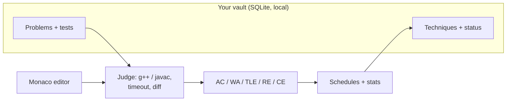

# Airlock

<p align="center">
  
</p>

<p align="center">
  <a href="https://github.com/SilesterGold9/airlock/releases"></a>
  <a href="https://github.com/SilesterGold9/airlock/stargazers"></a>
  
  <a href="./LICENSE"></a>
</p>

<p align="center">
  An <strong>offline-first competitive programming trainer</strong> for ICPC-style
  preparation: a local problem vault, a real local judge (C++ and Java), timed
  contests with penalty scoring, and a training methodology built in — not bolted on.
</p>



## Quick start

Prerequisites per OS are in [Installation](#installation). Then:

```bash
npm install
npm run tauri dev
python3 scripts/seed_problems.py ~/.local/share/com.silvestre.airlock/airlock.sqlite
```

Restart the app and the two sample problems show up in Practice. That's the
whole loop: write code, submit, get a verdict, repeat — no account, no network.

## Features

| | |
|---|---|
| Practice workspace | LeetCode-style split view: statement tabs, Monaco editor, per-test console with diff viewer on WA |
| Local judge | Compiles C++ (`g++ -O2 -std=c++17`) and Java against your own toolchain, per-test timeout, whitespace-tolerant diff, partial `passed/total` counts |
| Contest mode | Timed virtual contests, ICPC penalty scoring, team seats with driver rotation, upsolve tagging, past-contest review |
| Technique tracker | Assimilated / Learning / Rusty status per technique, one-click reassessment after a break, recall mode (reimplement from memory on a timer) |
| Training sets | Auto-composed confidence + target + stretch + review picks from your technique status — no cherry-picking |
| Failure labels | Tag every WA (conceptual, indexing, misread…) so stats tell you *what kind* of miss, not just where |
| Rank journey | Personal milestone track with written reflections, original theme included |
| Problem packs | Share curated problem sets as a folder; exports are allowlist-only so submissions and notes never leak |
| Stress lab | Fuzz your solution against a brute force with a generator |
| EN + PT | Full Portuguese localization, one toggle |

## Fork it

It's open-source — take it, tweak it, use it. MIT licensed, no strings
attached. If Airlock fits your training but not your setup:

- **Rename it**: `productName` + `identifier` in
  `src-tauri/tauri.conf.json`. Your data dir follows the identifier, so
  decide once — old installs don't follow renames.
- **Restyle it**: tokens live in `tailwind.config.js` + `src/index.css`;
  the rank journey ships an original theme and accepts custom ones.
- **Reseed it**: swap `sample-problems/` or ship a `packs/` folder.
  Exports are allowlist-only, so sharing never leaks submissions or notes.
- **Extend it**: `CONTRIBUTING.md` has the map — commands, migrations,
  verify loop. PRs back upstream are welcome, never owed. That's the
  point of MIT.

## Why a local vault

Codeforces doesn't publish official test data — only statements and sample
I/O. So Airlock treats the vault as **yours to curate**: paste problems in
while you have internet, then train offline. For anything you want fully
judged, add your own tests — or write a brute-force reference and fuzz
against it in the stress lab. Building that habit is an ICPC skill anyway.

Good sources with downloadable test data: old ICPC regional archives,
Kattis problem packages, UVA.

## Installation

<details>
<summary><strong>Arch Linux</strong></summary>

```bash
sudo pacman -S --needed webkit2gtk-4.1 base-devel curl wget file openssl \
    gtk3 libayatana-appindicator librsvg
rustup default stable   # if you don't already have rustup
```

</details>

<details>
<summary><strong>Windows</strong></summary>

WebView2 ships with Windows 10/11 (otherwise install it once from
Microsoft). Then: Visual Studio Build Tools with the C++ workload,
Rust via `rustup-init.exe`, Node.js LTS. No code changes needed.

</details>

<details>
<summary><strong>macOS</strong></summary>

```bash
xcode-select --install
```

Then Rust via rustup and Node.js LTS. No code changes needed.

</details>

```bash
npm install
npm run tauri dev     # hot reload, opens a native window
npm run tauri build   # installable binary → src-tauri/target/release/bundle/
```

First run creates the SQLite DB at
`~/.local/share/com.silvestre.airlock/airlock.sqlite` (auto-migrates the old
`com.silvestre.cptrainer` location). Before your first `tauri build`,
regenerate icons with `npm run tauri icon` (see `assets/`).

## Sharing packs

```bash
# Import a curated set (keeps your technique status and notes)
python3 scripts/import_pack.py packs/week-1-implementation ~/.local/share/com.silvestre.airlock/airlock.sqlite

# Export yours — problems and technique names only, never personal data
python3 scripts/export_pack.py ~/.local/share/com.silvestre.airlock/airlock.sqlite /tmp/my-pack --name "My Pack"
```

## Project layout

```
src/                 React frontend (pages, components, i18n)
src-tauri/src/       Rust backend: judge.rs, db.rs (SQLite), commands.rs
sample-problems/     Problem JSON template (same shape as the Problem struct)
packs/               Shareable problem packs + manifest
scripts/             seed_problems.py, import_pack.py, export_pack.py
ROADMAP_AIRLOCK.md   Feature backlog · DESIGN_SYSTEM.md  UI tokens
CONTRIBUTING.md      How to work in this repo
```

## Status

Everything on the original scaffold, the Oct 15 methodology backlog, and the
v2.0 UI revamp is built and released. Live state lives on GitHub, not in
this file: [Milestones](https://github.com/SilesterGold9/airlock/milestones)
· [Releases](https://github.com/SilesterGold9/airlock/releases) · [Issues](https://github.com/SilesterGold9/airlock/issues).

Known limits: wall-clock timeout only (no memory/CPU caps — fine for solo
practice, don't run strangers' code here); contest timer uses a `"current"`
placeholder id for live contests.

## Contributing

Issues and PRs welcome. Read [CONTRIBUTING.md](./CONTRIBUTING.md) first —
one commit per issue, `npm run build` + offline `cargo check` must pass.

## License

MIT — see [LICENSE](./LICENSE).

---

[](https://star-history.com/#SilesterGold9/airlock&Date)
